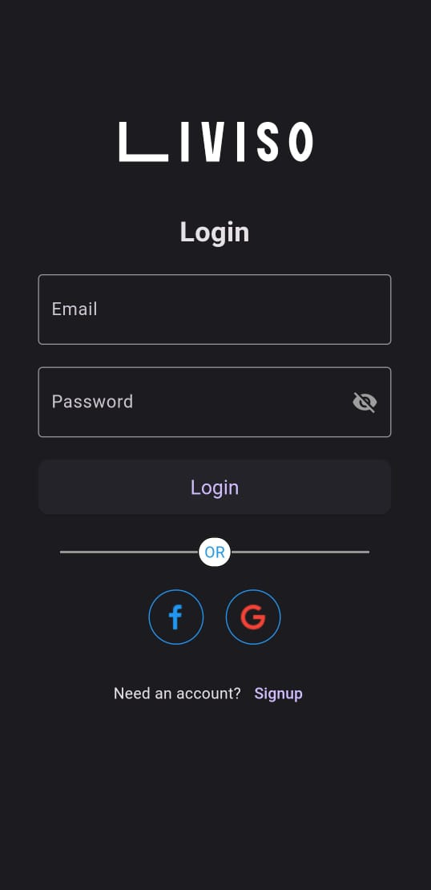
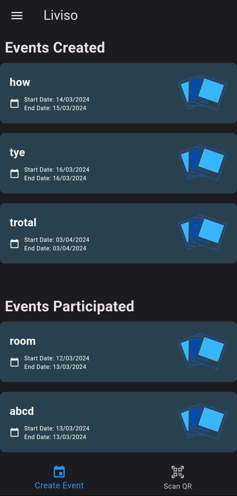
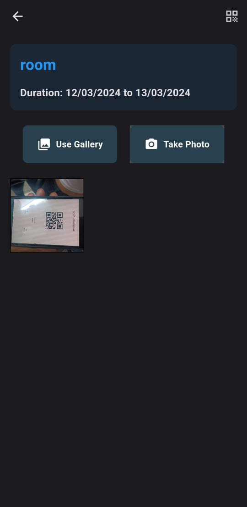

# Liviso - Dynamic Camera Event App

**Liviso** is a dynamic Camera Event App developed using Flutter and Dart. The app integrates Firebase for seamless data management and user authentication, allowing users to create events, upload photos, share QR codes, and receive push notifications for ongoing events.

## Features

- **Event Creation**: Users can create events with a name, start and end dates, and upload images.
- **QR Code Generation**: Unique QR codes are generated for each event, facilitating easy sharing and access.
- **Push Notifications**: Receive notifications for ongoing events, including reminders and updates.
- **Real-Time Interaction**: Facilitate interaction among participants with real-time updates and notifications.

  ## Screenshots

Here are some screenshots of the app in action:

### Login Page


### Home Screen


### QR Code Generation


### Event Description Page


## Technologies Used

- **Flutter**: UI toolkit for building natively compiled applications for mobile, web, and desktop from a single codebase.
- **Dart**: Programming language used with Flutter for building app logic.
- **Firebase**: Provides cloud storage, real-time database, authentication, and notification services.
- **Awesome Notifications**: For handling and displaying local notifications.

## Installation

1. **Clone the repository**:
    ```bash
    git clone https://github.com/Maitrey27/liviso.git
    cd liviso
    ```

2. **Install dependencies**:
    ```bash
    flutter pub get
    ```

3. **Set up Firebase**:
    - Create a Firebase project and add Firebase credentials to your app.
    - Follow the Firebase setup instructions for Flutter [here](https://firebase.flutter.dev/docs/overview).

4. **Run the app**:
    ```bash
    flutter run
    ```

## Usage

1. **Create an Account**: Sign up or log in using Firebase Authentication.
2. **Create an Event**: Use the app to create events by providing details such as name, start date, end date, and image.
3. **Generate QR Code**: Each event will have a unique QR code for sharing.
4. **Receive Notifications**: Get push notifications for event reminders and updates.

## Contributing

Contributions are welcome! Please submit a pull request or open an issue to discuss changes.
